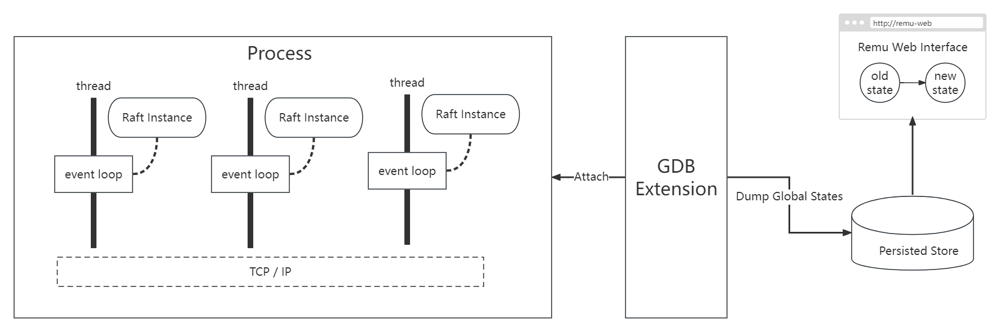
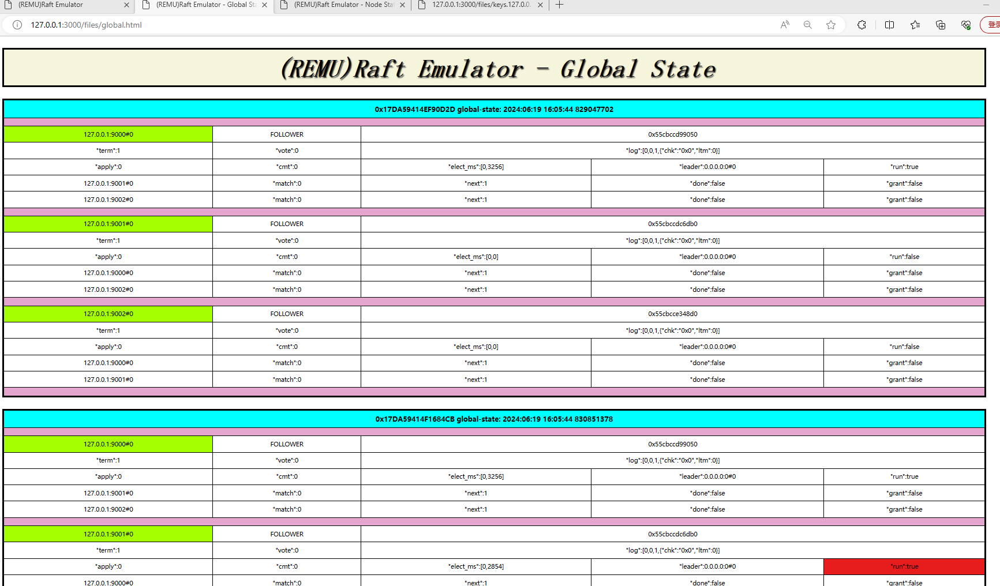
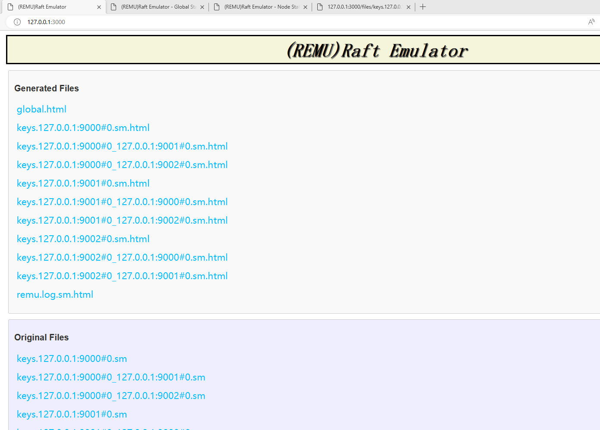
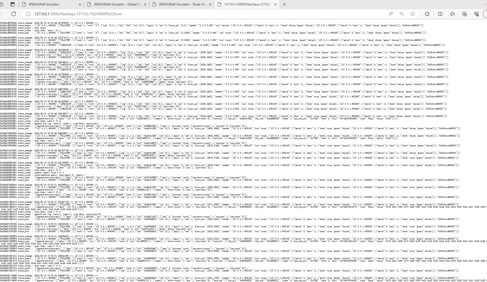

# vraft

# Architecture
## SEDA (Staged Event-Driven Architecture)
* vraft implements a SEDA architecture.
* The reference paper for the SEDA architecture is as follows.
  * https://www.cs.princeton.edu/courses/archive/fall15/cos518/studpres/seda.pdf

## VRaft-SEDA

# REMU (Raft Emulator)

## 1 - Remu-Architecture

## 2 - Web Interface

### 2.1 global state

### 2.2 node state

### 2.3 index page

### 2.4 log

