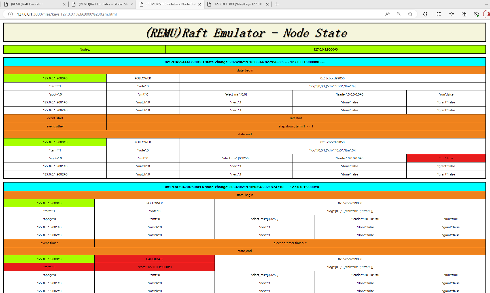

# 1 - Architecture
## SEDA (Staged Event-Driven Architecture)
* VRaft implements a SEDA architecture.
* The reference paper for the SEDA architecture is as follows.
  * https://www.cs.princeton.edu/courses/archive/fall15/cos518/studpres/seda.pdf

## VRaft-SEDA

# 2 - REMU (Raft Emulator)

## Remu-Architecture

## Web Interface

#### global state

#### node state

#### index page

#### log

